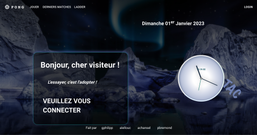

README
======


# project42_transcendence

Group project to be done between 3 and 5 students, we were 4.

Developpement of a website, entirely mounted in Typescript, allowing to play the famous Pong game.

*I was in charge of the front-end part of the Home page, which welcomes any visitor to the website.*




## Installation:

 - Prerequis version node: v16.17.0
 - timeout command `brew install coreutils`

### Back

#### Apply Migration of psql

Prepare Postgres (Docker with psql should be running, eg `make`).

```
# It is now automatic with `make run_back`
cd app/pong
npm install
npx prisma migrate deploy
```

If you want to read about: [How to make a migration?](https://docs.nestjs.com/recipes/prisma#create-two-database-tables-with-prisma-migrate)

## Usage

### How to run project for dev ?

Open 3 terminal session:
 - `make run_psql` to run docker and database ;
 - `make run_front` to run front (React) ;
 - `make run_back` to run back (Nestjs).

### How to create and login a fake account ?

Open a url to: `http://127.0.0.1:8190/auth/fake/<login>`

## Docs :

 - **Material-ui docs:** https://mui.com/material-ui/getting-started/usage/
 - **Nestjs docs:** https://docs.nestjs.com/
 - **Prisma docs:** https://www.prisma.io/docs/
